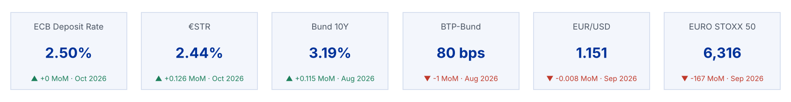
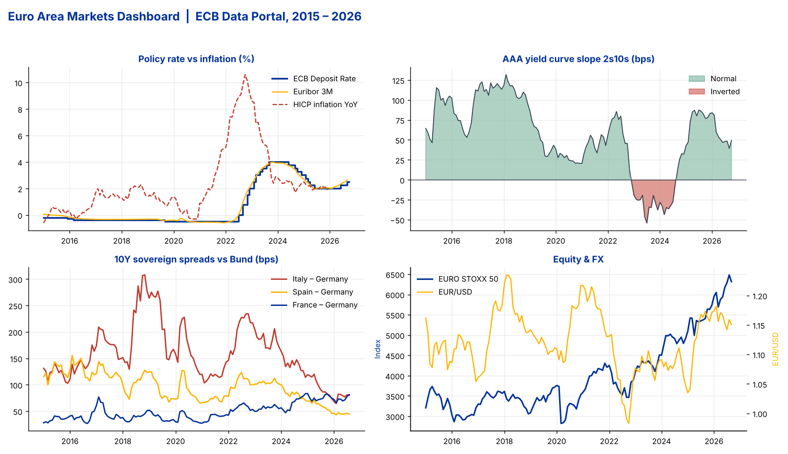

# Euro Area Markets Pipeline + Power BI

An end-to-end data pipeline that pulls **euro-area rates, sovereign yields, FX, equity and inflation data** from the **ECB Data Portal API**, validates it, models it as a **star schema**, and feeds a **Power BI dashboard** that refreshes automatically.

### Dashboard walkthrough


▶ **[Full HD video (MP4, 87 s)](docs/dashboard_walkthrough.mp4)**: KPI cards, period slicer, rates & yield curve, sovereign spreads, FX & equity.
*The walkthrough shows an HTML replica of the report built on the same star schema and measures as the Power BI model in [`powerbi/`](powerbi).*




---

## Why this project
Frankfurt is home to the ECB, Deutsche Börse and Germany's biggest banks. Rates desks, treasury, risk and MIS teams there track the same handful of numbers every day: the ECB policy rate, €STR / Euribor, Bund yields, periphery spreads, the curve slope and EUR FX. This project automates that daily market monitor, from raw API data to a decision-ready dashboard.

## Architecture
```
ECB Data Portal API (SDMX REST, 14 series)
        │  extract.py   – retry logic, one request per series
        ▼
Raw daily / monthly observations
        │  transform.py – monthly roll-up (mean / month-end), derived spreads
        │  quality.py   – range checks, staleness checks, duplicate checks
        ▼
Star schema ──► data/processed/*.csv  ──► Power BI (Power Query from GitHub raw URLs)
            └─► data/euro_markets.db  ──► SQL analysis (sql/analysis_queries.sql)

GitHub Actions (monthly cron) re-runs the pipeline and commits fresh data
```

## Data covered (Jan 2015 → latest)
| Category | Series |
|---|---|
| Policy & money market | ECB Deposit Facility Rate, €STR, Euribor 3M |
| Sovereign yields | Germany, France, Italy, Spain 10Y |
| Yield curve | Euro AAA curve 2Y & 10Y |
| FX | EUR/USD, EUR/GBP, EUR/INR |
| Equity | EURO STOXX 50 |
| Inflation | HICP headline YoY |
| **Derived** | 2s10s slope, BTP-Bund / OAT-Bund / Bono-Bund spreads (bps), real deposit rate |

## Data model
```
dim_date (date_key, month_start, year, quarter, month_name …)
     1
     │
     * 
fact_market_monthly (date_key, series_id, value, mom_change, yoy_change, mom_pct, yoy_pct)
     *
     │
     1
dim_series (series_id, series_name, category, unit, ecb_key, is_derived)
```
`kpi_latest.csv` holds the latest reading per series for KPI cards.

## Key insights from the data
- **Hiking cycle:** the ECB moved the deposit rate from **-0.50% to 4.00%** between Jul 2022 and Sep 2023, its fastest tightening on record, then cut back to 2.00% by mid-2025.
- **Curve inversion:** the AAA 2s10s slope was **inverted from late 2022 to mid-2024** (low around **-54 bps**), a classic late-cycle signal.
- **Periphery risk:** the BTP-Bund spread peaked at **~308 bps (Nov 2018)** during the Italian budget standoff and has since compressed to **~80 bps**. By Aug 2026 the **OAT-Bund spread (~82 bps) is at or above BTP-Bund**, showing how much French risk has been repriced.
- **Real rates:** the real deposit rate (DFR − HICP) was negative in **106 of 132 months** since 2015.
- **Equities:** EURO STOXX 50 roughly **doubled** from its 2020 Covid low to above 6,000 in 2026.

## Run it
```bash
git clone https://github.com/SaurHub007/euro-area-markets-pipeline.git
cd euro-area-markets-pipeline
pip install -r requirements.txt

python run_pipeline.py            # live pull from the ECB API
python run_pipeline.py --offline  # rebuild from the committed snapshot (no internet)
python make_charts.py             # regenerate README images
pytest -q                         # unit tests
sqlite3 data/euro_markets.db < sql/analysis_queries.sql
```

## Power BI
Everything needed to build the report is in [`powerbi/`](powerbi):
- `power_query.m` – M queries that load the CSVs straight from this repo (so refresh works in Power BI Service)
- `measures.dax` – 25+ measures: latest value, MoM / YoY, 3M average, YTD return, `Curve Status`, `Policy Stance`, conditional-format colours
- `euro_markets_theme.json` – report theme
- `DASHBOARD_GUIDE.md` – page-by-page layout (Executive Overview, Rates & Curve, Sovereign Spreads, FX & Equity)

## Project structure
```
├── run_pipeline.py          # orchestrator (extract → transform → DQ → load)
├── make_charts.py           # dashboard preview images
├── src/euro_markets/
│   ├── config.py            # series catalogue (ECB keys, units, aggregation rule)
│   ├── extract.py           # ECB API client
│   ├── transform.py         # monthly roll-up, spreads, star schema
│   ├── quality.py           # data-quality checks
│   └── load.py              # CSV + SQLite writer
├── data/raw/                # monthly snapshot (enables offline runs)
├── data/processed/          # fact & dimension tables for Power BI
├── sql/analysis_queries.sql # CTEs, window functions, rankings
├── powerbi/                 # M, DAX, theme, build guide
├── tests/                   # pytest unit tests
└── .github/workflows/       # scheduled refresh
```

## Notes
- Source: [ECB Data Portal](https://data.ecb.europa.eu/) – free, no API key.
- HICP headline (`ICP/M.U2.N.000000.4.ANR`) currently ends at Dec 2025 on the API; the quality check flags it as stale instead of failing silently.
- Rates are monthly averages; the ECB deposit rate uses the month-end level.

## Tech stack
Python (pandas, requests) · SQL (SQLite, CTEs, window functions) · Power BI (Power Query M, DAX, star schema) · GitHub Actions · pytest

---
**Author:** Saurabh Khamkar – Data Analyst, capital markets · [GitHub](https://github.com/SaurHub007)
